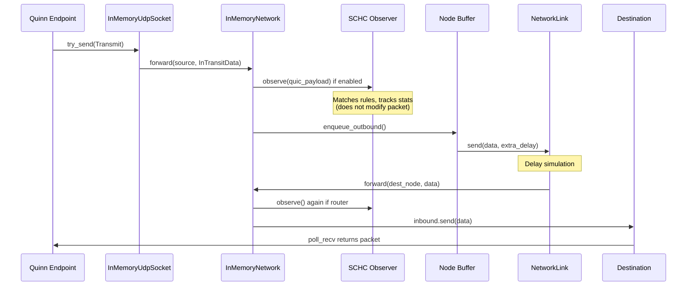

# SCHC-Quinn: QUIC Header Compression for Space Communication

A Rust implementation of SCHC (Static Context Header Compression) integrated with the Quinn QUIC workbench for simulating header compression in space communication scenarios.

## Overview

This project combines two components:

1. **SCHC Compressor** (`schc/`) - A streaming, rule-based header compression engine supporting IPv4/IPv6/UDP/QUIC (github: [SCHC](https://github.com/samsirohi11/schc_r_c))
2. **Quic Workbench** (`workbench/`) - An in-memory QUIC network simulator with time warping for deep-space RTT scenarios (github: [Quic Workbench](https://github.com/deepspaceip/dipt-quic-workbench))

The integration enables **observer mode** compression analysis: measuring potential SCHC compression gains on QUIC traffic without modifying the actual packets (since decompression isn't yet implemented).

---

## How SCHC Integrates with Quinn Workbench

### Integration Point in the Pipeline

The SCHC observer is integrated into the **packet forwarding layer** of the in-memory network simulation. For a detailed understanding of the workbench architecture, see [Quinn Workbench Architecture](workbench/quinn_workbench_architecture.md).

SCHC compression analysis occurs at a specific point in the packet flow:

```
┌─────────────────────────────────────────────────────────────────────────────┐
│                        PACKET FLOW WITH SCHC OBSERVER                       │
├─────────────────────────────────────────────────────────────────────────────┤
│                                                                             │
│   Quinn Endpoint                                                            │
│        │                                                                    │
│        ▼                                                                    │
│   InMemoryUdpSocket.try_send()                                              │
│        │                                                                    │
│        ▼                                                                    │
│   InMemoryNetwork.forward(source_node, InTransitData)                       │
│        │                                                                    │
│        ├──────────────────────────────────────────────────────┐             │
│        |                                                      │             │
│   ┌─────────────────────────────────────────────────────┐     │             │
│   │           SCHC OBSERVER INTERCEPT POINT             │◄────┘             │
│   │                                                     │                   │
│   │  if schc_observer enabled AND node in enabled_nodes │                   │
│   │       │                                             │                   │
│   │       ▼                                             │                   │
│   │  observer.observe(quic_payload, direction)          │                   │
│   │       │                                             │                   │
│   │       ├─► Build synthetic Ethernet+IP+UDP frame     │                   │
│   │       │   around QUIC payload                       │                   │
│   │       │                                             │                   │
│   │       ├─► Match against SCHC rule tree              │                   │
│   │       │                                             │                   │
│   │       └─► Accumulate compression statistics         │                   │
│   │                                                     │                   │
│   └─────────────────────────────────────────────────────┘                   │
│        │                                                                    │
│        ▼                                                                    │
│   Resolve link → Enqueue to outbound buffer                                 │
│        │                                                                    │
│        ▼                                                                    │
│   NetworkLink.send() → Packet delivered after delay                         │
│        │                                                                    │
│        ▼                                                                    │
│   Next node's forward() [SCHC observer may run again]                       │
│        │                                                                    │
│        ▼                                                                    │
│   Destination host receives packet                                          │
│                                                                             │
└─────────────────────────────────────────────────────────────────────────────┘
```

### Key Implementation Details

#### 1. Location in Code

The SCHC observer is invoked in [`in-memory-network/src/network/mod.rs`](workbench/in-memory-network/src/network/mod.rs) within the `forward()` method:

```rust
pub(crate) fn forward(
    self: &Arc<InMemoryNetwork>,
    current_node: Arc<Node>,
    data: InTransitData,
) {
    self.tracer.track_packet_in_node(&current_node, &data);

    // SCHC Observer: analyze compression potential at router nodes
    #[cfg(feature = "schc-observer")]
    if let Some(ref observer) = *self.schc_observer.read() {
        let should_observe = match &*self.schc_enabled_nodes.read() {
            Some(nodes) => nodes.contains(&current_node.id),
            None => current_node.udp_endpoint.is_none(), // Default: all routers
        };
        if should_observe {
            observer.observe(&data.transmit.contents, is_outgoing);
        }
    }
    // ... continue forwarding
}
```

#### 2. Observer Mode Behavior

The SCHC observer operates in **read-only mode**:

- **Does NOT modify packets**: The actual `InTransitData` is forwarded unchanged
- **Measures compression potential**: Calculates what compression would achieve if applied
- **Tracks statistics**: Aggregates packet counts, original/compressed sizes, and savings

#### 3. Node Selection

SCHC observation can be limited to specific nodes:

| Configuration               | Behavior                        |
| --------------------------- | ------------------------------- |
| `--schc-nodes MoonOrbiter1` | Only observe at MoonOrbiter1    |
| `--schc-nodes Node1,Node2`  | Observe at Node1 and Node2      |
| _(no --schc-nodes)_         | Observe at **all router nodes** |

By default, only **router nodes** are observed (nodes without UDP endpoints).

### Data Flow Diagram

For reference, here's how packets flow through the complete workbench (per the [architecture document](workbench/quinn_workbench_architecture.md)):



### Statistics Collected

The `SchcObserver` tracks:

| Statistic               | Description                                        |
| ----------------------- | -------------------------------------------------- |
| `packets_processed`     | Total packets seen by the observer                 |
| `packets_matched`       | Packets that matched at least one SCHC rule        |
| `total_original_bits`   | Sum of original header sizes (IP+UDP+QUIC)         |
| `total_compressed_bits` | Sum of compressed header sizes (rule ID + residue) |

---

## Quick Start

```bash
# Build with SCHC observer support
cd workbench
cargo build --release --features schc-observer

# Run Earth-Moon simulation with SCHC compression analysis
cargo run --release --features schc-observer --bin quinn-workbench -- quic \
  --network-graph test-data/earth-moon/networkgraph-1orbiter-1moonasset.json \
  --network-events test-data/earth-moon/events.json \
  --client-ip-address 192.168.40.1 \
  --server-ip-address 192.168.41.2 \
  --requests 3 \
  --schc-observer \
  --schc-rules ../schc/quic_test.json \
  --schc-field-context ../schc/field-context.json \
  --schc-nodes MoonOrbiter1

# Enable verbose debug output to see rule matching
cargo run --release --features schc-observer --bin quinn-workbench -- quic \
  ... \
  --schc-debug
```

## Project Structure

```
schc_quinn/
├── .git/
├── .gitignore
├── README.md
│
├── schc/                        # SCHC compression library
│   ├── Cargo.toml
│   ├── src/                     # Core implementation
│   │   ├── lib.rs               # Library entry point
│   │   ├── parser.rs            # Streaming packet parser
│   │   ├── compressor.rs        # Compression actions (CDAs)
│   │   ├── matcher.rs           # Matching operators (MOs)
│   │   ├── tree.rs              # Rule tree building
│   │   └── streaming_tree.rs    # Unified parse+match+compress
│   ├── quic_rules.json          # Full QUIC compression rules
│   ├── quic_test.json           # Simplified test rules
│   └── field-context.json       # Field size definitions
│
└── workbench/                   # Quinn QUIC simulator
    ├── Cargo.toml
    ├── in-memory-network/       # Network simulation layer
    │   └── src/
    │       ├── schc_observer.rs # SCHC integration module ◄── Key file
    │       └── network/mod.rs   # forward() with SCHC hook
    ├── quinn-workbench/         # CLI application
    ├── test-data/               # Network scenarios
    │   └── earth-moon/          # Earth-Moon communication
    └── quinn_workbench_architecture.md  # Detailed architecture docs
```

## SCHC CLI Options

| Option                      | Description                                        |
| --------------------------- | -------------------------------------------------- |
| `--schc-observer`           | Enable SCHC compression analysis                   |
| `--schc-rules PATH`         | Path to SCHC rules JSON file                       |
| `--schc-field-context PATH` | Path to field context JSON file                    |
| `--schc-nodes NODE1,NODE2`  | Limit observation to specific router nodes         |
| `--schc-debug`              | Show detailed rule matching and compression output |

## Example Output

```
--- SCHC Observer ---
* Rules: ../schc/rules/quic_test.json
* Field context: ../schc/rules/field-context.json
* Enabled nodes: MoonOrbiter1
...
--- SCHC Observer Statistics ---
* Packets processed: 25
* Packets matched: 25 (100.0%)
* Total original header: 360 bits (45.0 bytes)
* Total compressed header: 375 bits (46.9 bytes)
* Compression savings: 0 bits (0.0%, ratio 0.96:1)
```

## Architecture Reference

For complete details on the Quinn Workbench simulation engine, including:

- **InMemoryNetwork** structure and initialization
- **Node** types (hosts vs routers)
- **NetworkLink** parameters (delay, bandwidth, failure injection)
- **Time warping** for deep-space RTT simulation
- **Packet flow** through the simulated network

See: [**Quinn Workbench Architecture**](workbench/quinn_workbench_architecture.md)

## Status

- ✅ SCHC compressor with rule tree matching
- ✅ QUIC header parsing (long/short headers)
- ✅ Quinn workbench integration (observer mode)
- 🔲 SCHC decompression
- 🔲 Actual packet compression (transmit compressed data)
- 🔲 Fragmentation/reassembly

## References

- [RFC 8724 - SCHC](https://www.rfc-editor.org/rfc/rfc8724)
- [RFC 9000 - QUIC](https://www.rfc-editor.org/rfc/rfc9000)
- [Quinn QUIC Implementation](https://github.com/quinn-rs/quinn)

## License

- SCHC Compressor: MIT
- Quinn Workbench: MIT/Apache-2.0
