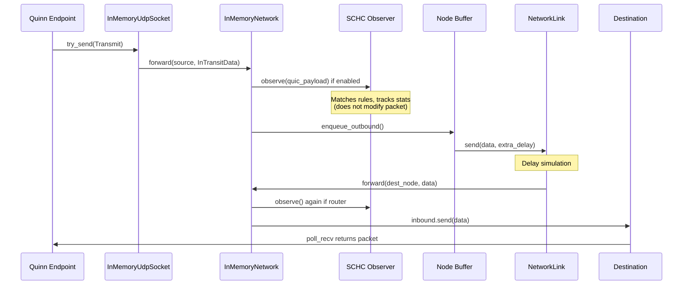
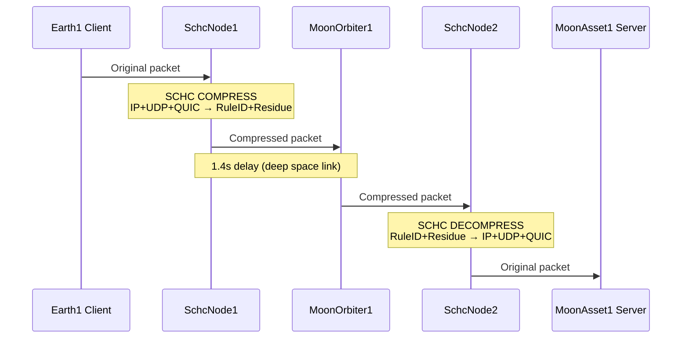

# SCHC-Quinn: QUIC Header Compression for Space Communication

A Rust implementation of SCHC (Static Context Header Compression) integrated with the Quinn QUIC workbench for simulating header compression in space communication scenarios.

## Overview

This project combines two components:

1. **SCHC Compressor** (`schc/`) - A streaming, rule-based header compression engine supporting IPv4/IPv6/UDP/QUIC (github: [SCHC](https://github.com/samsirohi11/schc_r_c))
2. **Quic Workbench** (`workbench/`) - An in-memory QUIC network simulator with time warping for deep-space RTT scenarios (github: [Quic Workbench](https://github.com/deepspaceip/dipt-quic-workbench))

---

## How SCHC Integrates with Quinn Workbench

The integration provides two distinct operational modes:

1. **Observer Mode** (`--schc-observer`): Read-only analysis that measures compression potential without modifying packets
2. **Compressor Mode** (`--schc-compress`): Actual packet compression and decompression at designated network nodes

### Observer Mode: Integration Point

The SCHC observer is integrated into the **packet forwarding layer** of the in-memory network simulation. For a detailed understanding of the workbench architecture, see [Quinn Workbench Architecture](workbench/quinn_workbench_architecture.md).

SCHC compression analysis occurs at a specific point in the packet flow:

```
┌─────────────────────────────────────────────────────────────────────────────┐
│                   PACKET FLOW WITH SCHC OBSERVER / COMPRESSOR               │
├─────────────────────────────────────────────────────────────────────────────┤
│                                                                             │
│   Quinn Endpoint                                                            │
│        │                                                                    │
│        ▼                                                                    │
│   InMemoryUdpSocket.try_send()                                              │
│        │                                                                    │
│        ▼                                                                    │
│   InMemoryNetwork.forward(source_node, InTransitData)                       │
│        │                                                                    │
│        ├──────────────────────────────────────────────────────┐             │
│        │                                                      │             │
│   ┌─────────────────────────────────────────────────────┐     │             │
│   │      SCHC INTERCEPT POINT (in forward() method)     │◄────┘             │
│   │                                                     │                   │
│   │  ┌───────────────────────────────────────────────┐  │                   │
│   │  │ OBSERVER MODE (--schc-observer)               │  │                   │
│   │  │  • Builds synthetic Ethernet+IP+UDP frame     │  │                   │
│   │  │  • Matches against SCHC rule tree             │  │                   │
│   │  │  • Accumulates statistics (read-only)         │  │                   │
│   │  │  • Does NOT modify packet                     │  │                   │
│   │  └───────────────────────────────────────────────┘  │                   │
│   │                      OR                             │                   │
│   │  ┌───────────────────────────────────────────────┐  │                   │
│   │  │ COMPRESSOR MODE (--schc-compress)             │  │                   │
│   │  │  If near source:                              │  │                   │
│   │  │    • COMPRESS: headers → rule ID + residue    │  │                   │
│   │  │  If near destination:                         │  │                   │
│   │  │    • DECOMPRESS: rule ID + residue → headers  │  │                   │
│   │  │  • MODIFIES packet in-flight                  │  │                   │
│   │  └───────────────────────────────────────────────┘  │                   │
│   │                                                     │                   │
│   └─────────────────────────────────────────────────────┘                   │
│        │                                                                    │
│        ▼                                                                    │
│   Resolve link → Enqueue to outbound buffer                                 │
│        │                                                                    │
│        ▼                                                                    │
│   NetworkLink.send() → Packet delivered after delay                         │
│        │                                                                    │
│        ▼                                                                    │
│   Next node's forward() [SCHC runs again at each enabled node]              │
│        │                                                                    │
│        ▼                                                                    │
│   Destination host receives packet                                          │
│                                                                             │
└─────────────────────────────────────────────────────────────────────────────┘
```

### Compressor Mode: Bidirectional Compression

When compressor mode is enabled, SCHC performs **actual packet compression and decompression** at designated nodes. The system determines whether to compress or decompress based on the node's position relative to the packet's source and destination.

#### Compression/Decompression Decision Logic

The system determines whether to compress or decompress based on **node proximity**:

| Node Position           | Action           | Reason                                        |
| ----------------------- | ---------------- | --------------------------------------------- |
| Near packet source      | **Compress**     | Reduce data before bandwidth-constrained link |
| Near packet destination | **Decompress**   | Restore headers for endpoint processing       |
| Both or neither         | **Pass-through** | Node not on constrained link boundary         |

Proximity is determined by comparing the node's interface subnets with the packet's source/destination subnets.

#### Direction-Aware Rule Matching

The compressor uses **directional rules** to correctly match fields based on packet flow:

- **UP direction**: Packets from lower subnet (Earth: `192.168.40.x`) to higher (Moon: `192.168.41.x`)
- **DOWN direction**: Packets from higher subnet (Moon) to lower (Earth)

This allows rules to use directional field identifiers like `UDP.DEV_PORT` and `UDP.APP_PORT` that resolve differently based on direction.

### Key Implementation Details

#### Observer Mode Behavior

The SCHC observer operates in **read-only mode**:

- **Does NOT modify packets**: The actual `InTransitData` is forwarded unchanged
- **Measures compression potential**: Calculates what compression would achieve if applied
- **Tracks statistics**: Aggregates packet counts, original/compressed sizes, and savings

#### Compressor Mode Behavior

The SCHC compressor **modifies packets in-flight**:

- **Builds synthetic frames**: Wraps QUIC payload with synthetic Ethernet+IP+UDP headers for SCHC processing
- **Compresses at source-side node**: Replaces IP+UDP+QUIC headers with compact SCHC format (rule ID + residues)
- **Decompresses at destination-side node**: Reconstructs original headers from SCHC data using shared rule context
- **Preserves application payload**: Only headers are compressed; payload passes through unchanged

#### Node Selection

SCHC can be limited to specific nodes:

**Observer Mode:**
| Configuration | Behavior |
| --------------------------- | ------------------------------- |
| `--schc-nodes MoonOrbiter1` | Only observe at MoonOrbiter1 |
| `--schc-nodes Node1,Node2` | Observe at Node1 and Node2 |
| _(no --schc-nodes)_ | Observe at **all router nodes** |

**Compressor Mode:**
| Configuration | Behavior |
| ------------------------------------ | ----------------------------------------------- |
| `--schc-compress-nodes Node1,Node2` | Compress/decompress at Node1 and Node2 |
| _(no --schc-compress-nodes)_ | **No compression** (must be explicitly enabled) |

By default, observer runs on all routers, but compressor must be explicitly enabled per-node.

### Data Flow Diagrams

For reference, here's how packets flow through the complete workbench for each mode (per the [architecture document](workbench/quinn_workbench_architecture.md)):

#### Observer Mode Flow



#### Compressor Mode Flow (Earth → Moon)



### Statistics Collected

**Observer Mode** (`SchcObserver`):

| Statistic               | Description                                        |
| ----------------------- | -------------------------------------------------- |
| `packets_processed`     | Total packets seen by the observer                 |
| `packets_matched`       | Packets that matched at least one SCHC rule        |
| `total_original_bits`   | Sum of original header sizes (IP+UDP+QUIC)         |
| `total_compressed_bits` | Sum of compressed header sizes (rule ID + residue) |

**Compressor Mode** (`SchcCompressor`):

| Statistic                      | Description                                     |
| ------------------------------ | ----------------------------------------------- |
| `packets_compressed`           | Total packets compressed at source nodes        |
| `packets_decompressed`         | Total packets decompressed at dest nodes        |
| `compression_failures`         | Packets that failed to compress                 |
| `decompression_failures`       | Packets that failed to decompress               |
| `total_original_header_bits`   | Sum of original header sizes before compression |
| `total_compressed_header_bits` | Sum of compressed header sizes                  |

---

## Quick Start

First make sure you have [rust installed](https://rust-lang.org/tools/install).

```bash
# Clone the repo and the submodule (schc compressor)
git clone --recurse-submodules https://github.com/samsirohi11/schc_quinn.git
# Or if already cloned:
git submodule update --init --recursive
```

```bash
# Build with SCHC observer, compressor support
cd workbench
cargo build --release --features schc-observer,schc-compressor

# Run Earth-Moon simulation with SCHC compression analysis (observer mode)
cargo run --release --features schc-observer --bin quinn-workbench -- quic \
  --network-graph test-data/earth-moon/networkgraph-1orbiter-1moonasset.json \
  --network-events test-data/earth-moon/events.json \
  --client-ip-address 192.168.40.1 \
  --server-ip-address 192.168.41.2 \
  --requests 3 \
  --schc-observer \
  --schc-rules ../schc/quic_rules.json \
  --schc-nodes MoonOrbiter1

# Run with SCHC compressor mode
cargo run --release --features schc-compressor --bin quinn-workbench -- quic \
  --network-graph test-data/earth-moon/networkgraph-schc-2nodes.json \
  --network-events test-data/earth-moon/events.json \
  --client-ip-address 192.168.40.1 \
  --server-ip-address 192.168.41.2 \
  --requests 3 \
  --schc-compress \
  --schc-rules ../schc/quic_rules.json \
  --schc-compress-nodes SchcNode1,SchcNode2

# Enable verbose debug output to see rule matching
cargo run --release --features schc-observer --bin quinn-workbench -- quic \
  ... \
  --schc-debug
```

## Project Structure

```
schc_quinn/
├── .git/
├── .gitignore
├── README.md
│
├── schc/                        # SCHC compression library
│   ├── Cargo.toml
│   ├── src/                     # Core implementation
│   │   ├── lib.rs               # Library entry point
│   │   ├── parser.rs            # Streaming packet parser
│   │   ├── compressor.rs        # Compression actions (CDAs)
│   │   ├── matcher.rs           # Matching operators (MOs)
│   │   ├── tree.rs              # Rule tree building
│   │   └── streaming_tree.rs    # Unified parse+match+compress
│   ├── quic_rules.json          # QUIC compression rules (version field)
│   └── field-context.json       # Field definitions (used at compile time)
│
└── workbench/                   # Quinn QUIC simulator
    ├── Cargo.toml
    ├── in-memory-network/       # Network simulation layer
    │   └── src/
    │       ├── schc_observer.rs # SCHC integration module ◄── Key file
    │       └── network/mod.rs   # forward() with SCHC hook
    ├── quinn-workbench/         # CLI application
    ├── test-data/               # Network scenarios
    │   └── earth-moon/          # Earth-Moon communication
    └── quinn_workbench_architecture.md  # Detailed architecture docs
```

## SCHC CLI Options

### Observer Mode

| Option                     | Description                                  |
| -------------------------- | -------------------------------------------- |
| `--schc-observer`          | Enable SCHC compression analysis (read-only) |
| `--schc-nodes NODE1,NODE2` | Limit observation to specific router nodes   |

### Compressor Mode

| Option                              | Description                                        |
| ----------------------------------- | -------------------------------------------------- |
| `--schc-compress`                   | Enable actual packet compression/decompression     |
| `--schc-compress-nodes NODE1,NODE2` | Nodes where compression/decompression is performed |

### Common Options

| Option              | Description                                        |
| ------------------- | -------------------------------------------------- |
| `--schc-rules PATH` | Path to SCHC rules JSON file                       |
| `--schc-debug`      | Show detailed rule matching and compression output |

## Example Output

### Observer Mode

```
--- SCHC Observer Statistics ---
* Packets processed: 48
* Packets matched: 48 (100.0%)
* Total original header: 11616 bits (1452.0 bytes)
* Total compressed header: 3456 bits (432.0 bytes)
* Compression savings: 8160 bits (70.2%, ratio 3.36:1)
```

### Compressor Mode

```
[SCHC Compress @ SchcNode1] [UP] Full packet header: 29 → 9 bytes (saved 20 bytes)
[SCHC Decompress @ SchcNode2] [UP] Full packet header: 9 → 29 bytes (restored 20 bytes)
...
--- SCHC Compressor Statistics ---
* Packets compressed: 16
* Packets decompressed: 16
* Compression failures: 0
* Decompression failures: 0
* Total original header: 3712 bits (464.0 bytes)
* Total compressed header: 1152 bits (144.0 bytes)
* Compression savings: 2560 bits (69.0%, ratio 3.22:1)
```

## References

- [RFC 8724 - SCHC](https://www.rfc-editor.org/rfc/rfc8724)
- [RFC 9000 - QUIC](https://www.rfc-editor.org/rfc/rfc9000)
- [Quinn QUIC Implementation](https://github.com/quinn-rs/quinn)

## License

- SCHC Compressor: MIT
- Quinn Workbench: MIT/Apache-2.0
