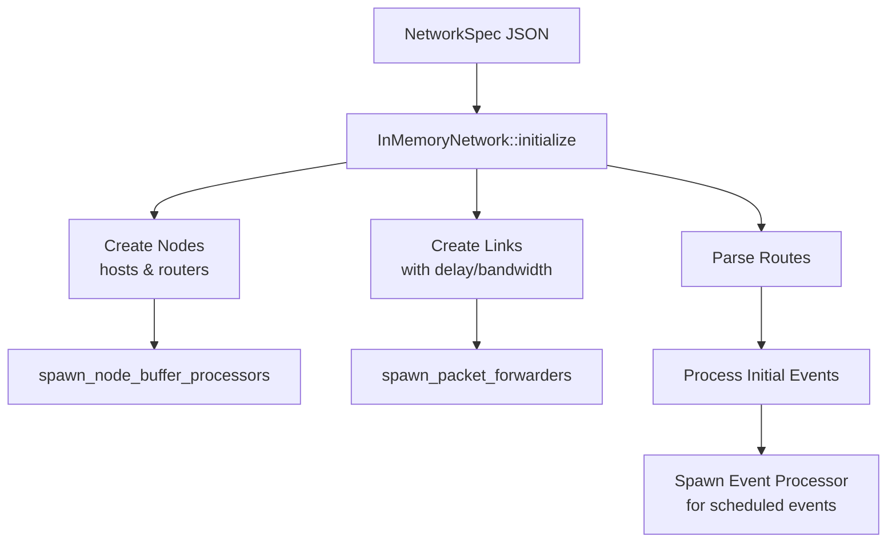
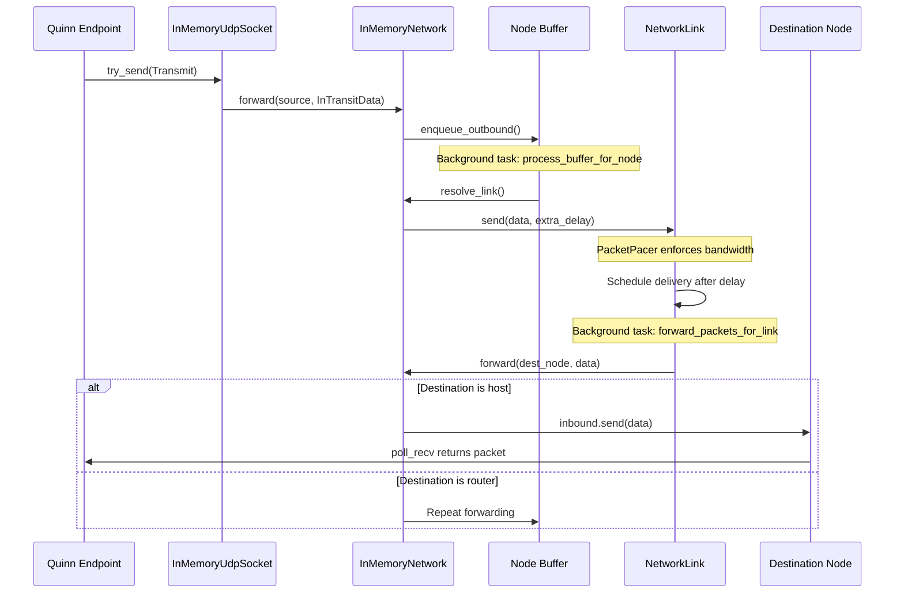
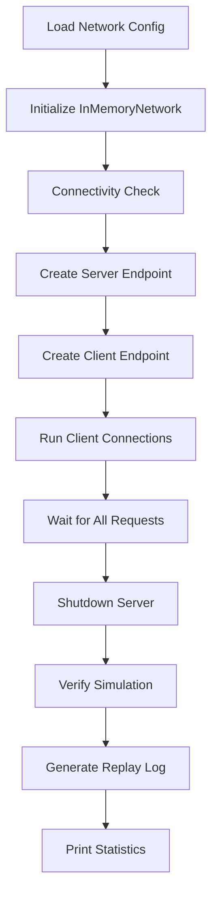

# Quinn Workbench Architecture

A comprehensive technical overview of the QUIC simulation workbench for space communication scenarios.

## Overview

The Quinn Workbench is a **deterministic, in-memory QUIC network simulator** designed to model space communication scenarios with deep-space-like RTTs (e.g., Earth-Moon, Earth-Mars). It enables testing QUIC protocol behavior under extreme conditions without actual network I/O.

### Key Characteristics

- **Pure Simulation**: No real I/O operations; everything runs in-memory within a single process
- **Time Warping**: Simulation clock advances automatically to the next event, completing multi-second RTT scenarios instantly
- **Deterministic**: Identical seeds produce identical results for reproducibility
- **Inspectable**: Generates synthetic PCAP files for Wireshark analysis
- **Configurable**: JSON-based network topology, events, and QUIC parameters

---

## Project Structure

```
dipt-quic-workbench/
├── Cargo.toml                    # Workspace config
├── in-memory-network/            # Core network simulation library
│   └── src/
│       ├── lib.rs                # Public API, InTransitData
│       ├── async_rt.rs           # Async runtime abstraction
│       ├── network/              # Network simulation core
│       │   ├── mod.rs            # InMemoryNetwork implementation
│       │   ├── node.rs           # Node (host/router) types
│       │   ├── link.rs           # NetworkLink with delay/bandwidth
│       │   ├── event.rs          # Network events (link up/down)
│       │   ├── inbound_queue.rs  # Packet delivery queues
│       │   ├── outbound_buffer.rs# Node outbound buffering
│       │   ├── route.rs          # Routing table
│       │   └── spec.rs           # Network specification types
│       ├── quinn_interop.rs      # Quinn UDP socket adapter
│       ├── pcap_exporter.rs      # PCAP file generation
│       ├── tracing/              # Simulation step tracing
│       └── transmit.rs           # OwnedTransmit wrapper
├── quinn-workbench/              # CLI application
│   └── src/
│       ├── main.rs               # Entry point
│       ├── config/               # Configuration loading
│       │   ├── cli.rs            # Command-line arguments
│       │   ├── network.rs        # Network graph parsing
│       │   └── quinn.rs          # QUIC configuration
│       ├── quic/                 # QUIC simulation
│       │   ├── mod.rs            # run_and_report_stats
│       │   ├── simulation.rs     # QuicSimulation orchestrator
│       │   ├── client.rs         # QUIC client logic
│       │   └── server.rs         # QUIC server logic
│       └── quinn_extensions/     # Custom congestion controllers
├── test-data/                    # Sample network configurations
│   ├── earth-moon/               # Moon communication scenario
│   ├── earth-mars/               # Mars communication scenario
│   └── earth-voyager/            # Deep space scenario
└── golden-tests/                 # Regression tests
```

---

## Core Components

### 1. InMemoryNetwork

The central simulation engine ([in-memory-network/src/network/mod.rs](file:///d:/Docs/SEED/R-SCHC/schc_quinn/dipt-quic-workbench/in-memory-network/src/network/mod.rs)).

```rust
pub struct InMemoryNetwork {
    nodes_by_addr: Arc<HashMap<IpAddr, Arc<Node>>>,
    routes_by_addr: Arc<HashMap<IpAddr, Arc<Vec<Route>>>>,
    links_by_addr: Arc<HashMap<(IpAddr, IpAddr), Arc<Mutex<NetworkLink>>>>,
    links_by_id: Arc<HashMap<Arc<str>, Arc<Mutex<NetworkLink>>>>,
    tracer: Arc<SimulationStepTracer>,
    rng: Mutex<Rng>,
    pcap_exporter_factory: Arc<dyn PcapExporterFactory>,
}
```

**Key Methods:**

| Method                  | Description                                        |
| ----------------------- | -------------------------------------------------- |
| `initialize()`          | Creates network from spec, spawns background tasks |
| `forward()`             | Routes packet to next hop or delivers to endpoint  |
| `udp_socket_for_node()` | Creates Quinn-compatible UDP socket for a host     |
| `host()`                | Retrieves host node by IP address                  |
| `resolve_link()`        | Finds appropriate link for packet destination      |

**Initialization Flow:**



---

### 2. Node

Represents network endpoints ([in-memory-network/src/network/node.rs](file:///d:/Docs/SEED/R-SCHC/schc_quinn/dipt-quic-workbench/in-memory-network/src/network/node.rs)).

```rust
pub struct Node {
    pub(crate) addresses: Vec<IpAddr>,
    pub(crate) id: Arc<str>,
    pub(crate) udp_endpoint: Option<Arc<UdpEndpoint>>,  // Only for hosts
    pub(crate) injected_failures: NodeInjectedFailures,
    outbound_buffer: Arc<OutboundBuffer>,
    outbound_tx: UnboundedSender<InTransitData>,
}

pub struct UdpEndpoint {
    pub inbound: Arc<Mutex<InboundQueue>>,  // Packets waiting for Quinn
    pub addr: SocketAddr,
}
```

**Node Types:**

| Type       | Description                   | Has UDP Endpoint |
| ---------- | ----------------------------- | ---------------- |
| **Host**   | QUIC endpoint (client/server) | ✓                |
| **Router** | Intermediate forwarding node  | ✗                |

**Failure Injection:**

- `packet_loss_ratio`: Random packet drop probability
- `packet_duplication_ratio`: Random packet duplication probability

---

### 3. NetworkLink

Simulates physical links with configurable characteristics ([in-memory-network/src/network/link.rs](file:///d:/Docs/SEED/R-SCHC/schc_quinn/dipt-quic-workbench/in-memory-network/src/network/link.rs)).

```rust
pub struct NetworkLink {
    pub(crate) id: Arc<str>,
    pub(crate) source: IpAddr,
    pub(crate) target: IpAddr,
    pub(crate) delay: Duration,
    pub(crate) bandwidth_bps: usize,
    pub(crate) extra_delay: Duration,
    pub(crate) extra_delay_ratio: f64,
    pub(crate) congestion_event_ratio: f64,
    status: LinkStatus,           // Up or Down
    inbound: InboundQueue,        // Packets in transit
    pacer: PacketPacer,           // Bandwidth enforcement
}
```

**Link Parameters:**

| Parameter                | Description                                     |
| ------------------------ | ----------------------------------------------- |
| `delay_ms`               | Propagation delay (e.g., 1500ms for Earth-Moon) |
| `bandwidth_bps`          | Maximum throughput in bits/second               |
| `extra_delay_ms`         | Additional jitter (applied probabilistically)   |
| `extra_delay_ratio`      | Probability of applying extra delay             |
| `congestion_event_ratio` | Probability of ECN CE marking                   |

> [!IMPORTANT]
> Links are **unidirectional**. Bidirectional communication requires two link entries.

---

### 4. Packet Flow

#### Transmission Path



#### Key Data Structure: InTransitData

```rust
pub struct InTransitData {
    pub id: Uuid,                        // Unique packet identifier
    pub duplicate: bool,                 // Was duplicated by failure injection
    pub source_id: Arc<str>,             // Origin node ID
    pub source_endpoint: Arc<UdpEndpoint>,
    pub transmit: OwnedTransmit,         // Actual packet data
    pub number: u64,                     // Sequence number for ordering
}

pub struct OwnedTransmit {
    pub destination: SocketAddr,
    pub ecn: Option<EcnCodepoint>,
    pub contents: Vec<u8>,               // Raw UDP payload (QUIC packet)
    pub segment_size: Option<usize>,
}
```

---

### 5. Quinn Integration

The `InMemoryUdpSocket` implements Quinn's `AsyncUdpSocket` trait ([in-memory-network/src/quinn_interop.rs](file:///d:/Docs/SEED/R-SCHC/schc_quinn/dipt-quic-workbench/in-memory-network/src/quinn_interop.rs)):

```rust
impl AsyncUdpSocket for InMemoryUdpSocket {
    fn try_send(&self, transmit: &Transmit) -> io::Result<()> {
        // 1. Track in PCAP
        self.pcap_exporter.track_transmit(source_addr, transmit);

        // 2. Create InTransitData from transmit
        let data = self.network.in_transit_data(&self.node, OwnedTransmit::from(transmit));

        // 3. Forward through network
        self.network.forward(self.node.clone(), data);
        Ok(())
    }

    fn poll_recv(&self, cx: &mut Context, bufs: &mut [IoSliceMut], meta: &mut [RecvMeta])
        -> Poll<io::Result<usize>>
    {
        // Wait for packets in the node's inbound queue
        // ...
    }
}
```

---

### 6. Time Warping

The simulation uses a custom async runtime (`sittard`) that advances the clock to the next scheduled event, enabling instant simulation of scenarios with minutes or hours of RTT.

```rust
// From async_rt module
cfg_if! {
    if #[cfg(feature = "rt-custom")] {
        // Uses sittard runtime with time warping
        use sittard::time::{sleep, sleep_until, timeout, Instant};
    } else if #[cfg(feature = "rt-tokio")] {
        // Uses standard tokio runtime (real time)
        use tokio::time::{sleep, sleep_until, timeout, Instant};
    }
}
```

---

## Configuration

### Network Topology (JSON)

```json
{
  "type": "NetworkGraph",
  "nodes": [
    {
      "id": "Earth1",
      "type": "host",
      "bufferSizeBytes": 1000000000,
      "interfaces": [{
        "addresses": [{"address": "192.168.40.1/24"}],
        "routes": [{"destination": "192.168.41.0/24", "next": "192.168.40.2", "cost": 100}]
      }],
      "quic": {
        "initial_rtt_ms": 7920000,
        "maximum_idle_timeout_ms": 7920000,
        "congestion_controller": "no_cc"
      }
    },
    {
      "id": "MoonOrbiter1",
      "type": "router",
      "bufferSizeBytes": 1000000000,
      "interfaces": [...]
    }
  ],
  "links": [
    {
      "id": "Earth1-MoonOrbiter1",
      "source": "192.168.40.1",
      "target": "192.168.40.2",
      "delay_ms": 1500,
      "bandwidth_bps": 10000000
    }
  ]
}
```

### Network Events (JSON)

```json
{
  "events": [
    { "time_ms": 0, "linkId": "Earth1-MoonOrbiter1", "status": "down" },
    { "time_ms": 60000, "linkId": "Earth1-MoonOrbiter1", "status": "up" }
  ]
}
```

---

## Simulation Execution

### Command Line

```bash
cargo run --release --bin quinn-workbench -- \
  quic \
  --network-graph test-data/earth-moon/networkgraph-1orbiter-1moonasset.json \
  --network-events test-data/earth-moon/events.json \
  --client-ip-address 192.168.40.1 \
  --server-ip-address 192.168.41.2 \
  --requests 5 \
  --response-size 1048576
```

### QuicSimulation Flow



### Output

```
--- Params ---
* Quinn seed: 12345
* Network seed: 67890
--- Network ---
* Initial link statuses (derived from events):
  * Earth1-MoonOrbiter1: DOWN
* Running connectivity check...
* Connectivity check passed (packets arrived after 1800 ms and 1800 ms)
--- Requests ---
0.00s [A] Connected to server-name at 192.168.41.2:8080
3.60s [A] Request 1 complete: received 1048576 bytes
...
--- Node stats ---
* Server (MoonAsset1): 5 packets sent, 5 packets received
* Client (Earth1): 5 packets sent, 5 packets received
```

## References

- [Quinn QUIC Implementation](https://github.com/quinn-rs/quinn)
- [RFC 9000 - QUIC](https://www.rfc-editor.org/rfc/rfc9000)
- [Sittard Async Runtime](https://github.com/cloudflare/sittard)
